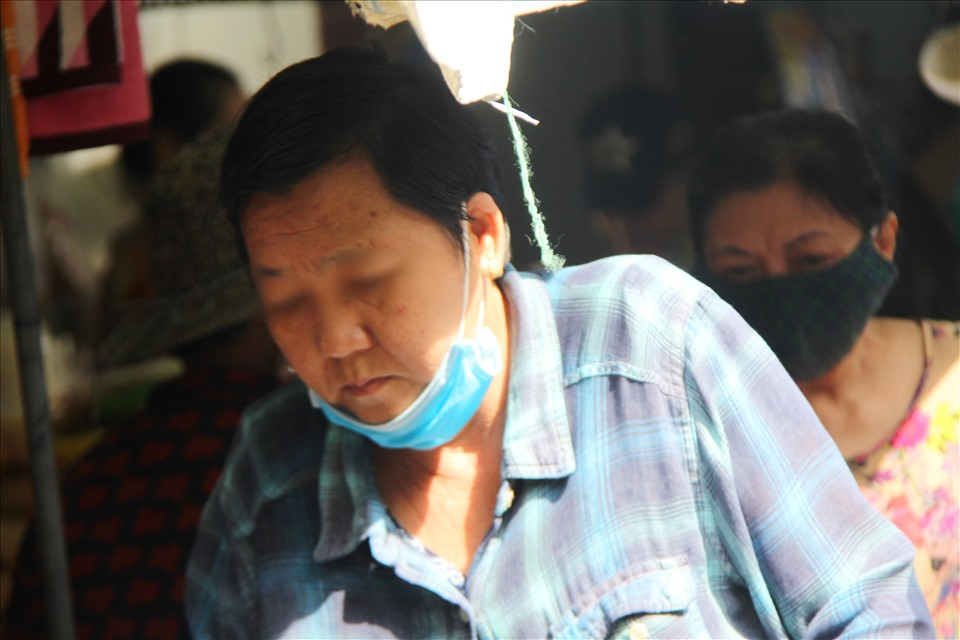
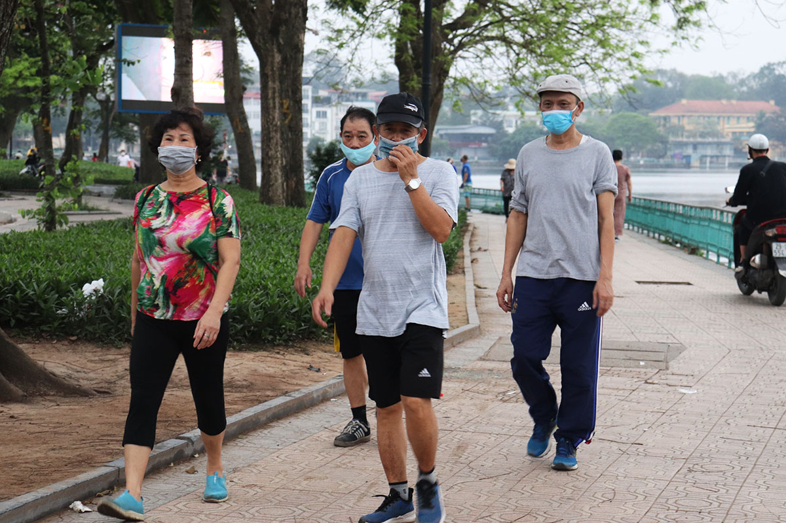
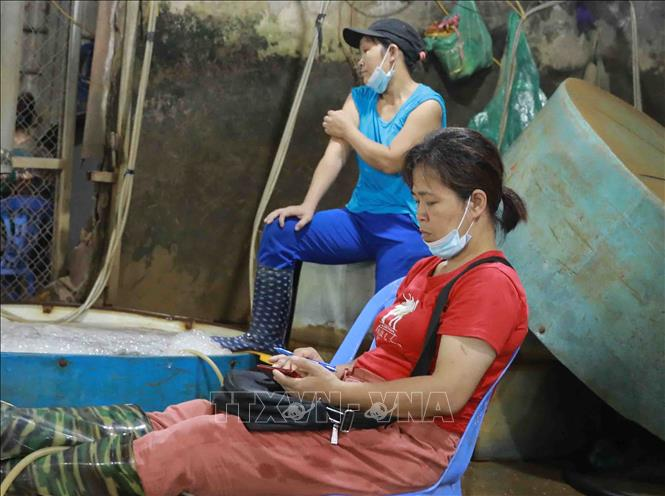
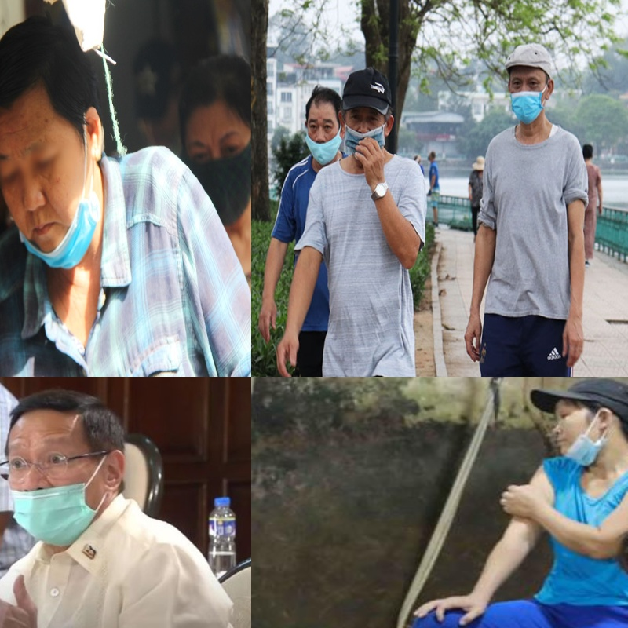

**This is an implementation for mosaic image augmention with YOLO format**

Run code to perform mosaic augmentation:
```python
python main.py --width 800 --height 800 --scale_x 0.4 --scale_y 0.6 --min_area 500 --min_vi 0.3
```

You can change parameters to fit with your dataset. To know details about arguments in the command above, run

```python
python main.py --help
```
- `--width`: width of mosaic-augmented image
- `--height`: height of mosaic-augmented image
- `--scale_x`: scale_x - scale by width => define width of the top left image
- `--scale_y`: scale_y - scale by height => define height of the top left image
- `--min_area`: min area of box after augmentation we will keep
- `--min_vi`: min area ratio of box after/before augmentation we will keep

**Example**

With 4 input images

Image 1                    |  Image 2                  |Image 3                    |  Image 4 
:-------------------------:|:-------------------------:|:-------------------------:|:-------------------------:
  |   |   |  

Output mosaic augmented image with YOLO format 
Mosaic-augmented image                                    |  Image with bboxes
:--------------------------------------------------------:|:-------------------------:
    |  

**Notes**
- Original images in the folder `images`
- Orginal labels (bounding boxes) in the folder `labels`
- Image and label have the same name. For example: img_0.jpeg - img_0.txt. 
- Format of image can be: .jpg, .jpeg, .png ...
- Mosaic-augmented images will be in the folder `augmentation/mosaic_images`. New labels will be in the folder `augmentation/mosaic_labels`. These folder will be automatically created when you run the code above.
